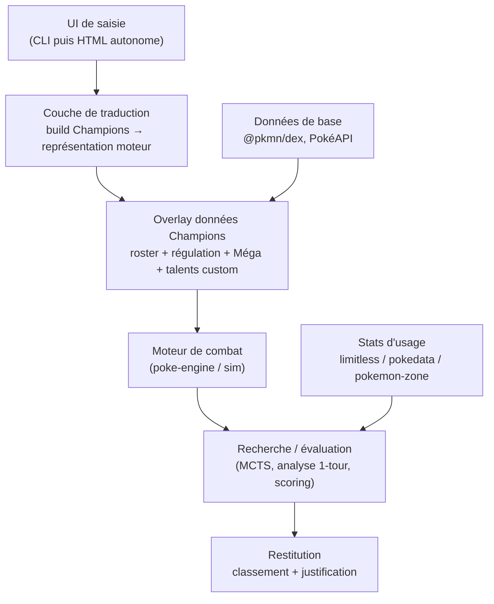

# Aide à la décision — Pokémon Champions
### Document socle de conception (v0.4)

> **Statut :** brouillon de travail, base de démarrage du projet.
> **Dernière mise à jour :** 23 juin 2026.
> **Périmètre :** outil **hors-ligne** d'aide à la décision pour Pokémon Champions, à **saisie manuelle**, s'appuyant sur un moteur de combat type Pokémon Showdown.
> **Hors périmètre (assumé) :** toute lecture automatique du jeu, overlay temps réel, ou automatisation des actions. Voir §3.

---

## Sommaire

0. Décisions actées (v0.2)
1. Vision et objectifs
2. Principe de fonctionnement
3. Cadre et légitimité (CGU)
4. Mécaniques de Champions à connaître (référence)
5. Architecture générale (vue en couches)
6. Choix du moteur de combat
7. Couche de données Champions (le « delta »)
8. Couche de traduction des stats
9. Représentation d'un état de tour (modèle de données)
10. Les modes de décision
11. Les modules fonctionnels
12. Stack technique proposée
13. Feuille de route par phases
14. Risques et points d'attention
15. Questions ouvertes à trancher
16. Sources

---

## 0. Décisions actées (v0.2)

Décisions validées qui orientent toute la conception. **Cette section fait foi** en cas d'ambiguïté ailleurs dans le document.

| # | Sujet | Décision |
|---|---|---|
| 1 | Format prioritaire | **Singles d'abord** (plus simple, moteur disponible), **architecture pensée Doubles** dès le départ |
| 2 | Ordre des modules | **Phase 0** (socle + dégâts), puis **B2** (aide au tirage) |
| 3 | Ambition B1 | **Recherche profonde** assumée |
| 4 | Plateforme & calcul | **Desktop web**, exécution sur **PC fixe à forte capacité de calcul** |
| 5 | Roster perso | L'outil **connaît mes Pokémon possédés** pour personnaliser les conseils |
| 6 | Stats d'usage | **Stats prêtes à l'emploi** (limitless / pokedata) pour amorcer le modèle d'adversaire |
| 7 | Langue | **Français par défaut**, bascule **FR/EN** prévue dans un second temps (i18n) |

### 0.1 « Recherche profonde » ≠ « modèle entraîné »

Point clé pour ne pas se tromper de chemin. Une recherche profonde performante repose sur **MCTS / ISMCTS profond + fonction d'évaluation faite main + priors d'usage** — pas nécessairement sur un réseau de neurones. C'est l'approche de *Foul Play*, qui bat déjà la plupart des bots sans apprentissage.

- Le **modèle entraîné** (réseau d'évaluation) est un **booster optionnel** de Phase 6, **pas un prérequis**.
- Pour Champions, il n'existe **pas de dump public de replays** (jeu fermé) → un éventuel réseau s'entraînerait par **transfert depuis le Singles Showdown** ou par **self-play**. Repoussé.
- Le **PC à forte capacité** permet d'aller loin sans réseau : **MCTS root-parallélisé**, nombreuses déterminisations, profondeur élevée.

### 0.2 Modèle d'adversaire : stats d'usage prêtes à l'emploi

- **Sources :** limitlesstcg.com (tournois en ligne) + pokedata.ovh (VGC réel), complétées par les tier lists pokemon-zone / game8.
- **Usage agrégé ≠ données d'entraînement.** L'usage agrégé sert de **priors** pour combler les inconnues adverses pendant la recherche. Les *trajectoires* (pour entraîner un modèle) sont un autre sujet, repoussé (§0.1).
- Le joueur peut **surcharger** tout prior dès qu'il observe une info réelle en partie.
- **Tâche :** écrire un petit importeur qui transforme ces stats en table de probabilités `espèce → {objets, moves, natures/SP types, coéquipiers}`.

### 0.3 Mon Box (Pokémon possédés)

L'outil tient un inventaire de mes Pokémon pour personnaliser B2 (synergie du tirage avec ce que j'ai déjà) et B3 (construction à partir de mon pool réel).

```python
@dataclass
class OwnedPokemon:
    species: str
    item: str | None
    ability: str
    nature: str
    stat_points: dict          # SP Champions (0..32)
    moves: list[str]
    status_ownership: str       # "trial" | "permanent" | "home_visitor"
    trial_expires_in_days: int | None   # si "trial"
    source: str                 # "ranch" | "home" | "event"
    is_shiny: bool
    has_title: bool
```

- Saisie manuelle au départ (pas de lecture du jeu — cf. §3).
- Sert à conseiller « tester d'abord (essai 7 j) » vs « investir 2 500 VP », et à pondérer le scoring du tirage selon mes trous d'équipe réels.

### 0.4 Architecture « Doubles-ready » bien qu'on démarre en Singles

On code Singles, mais **rien ne doit interdire le Doubles** plus tard :

- **Abstraction moteur :** une interface `BattleEngine` (méthodes `simulate_turn(state, my_action, opp_action)` et `search(state) -> ranked_actions`) avec un *backend* interchangeable. Backend v1 = `poke-engine` (Singles) ; backend Doubles ajouté plus tard sans toucher au reste.
- **Modèle de données déjà doubles-compatible :** `SideState.active` est une **liste** (1 en singles, 2 en doubles) ; prévoir des champs **cible** (`target`) et **portée** (`spread`) sur les actions, ignorés par le backend singles mais présents dans le schéma.
- Ne **jamais** coder en dur « un seul Pokémon actif » dans la logique métier hors backend.

### 0.5 Internationalisation (i18n)

- **IDs canoniques internes en anglais**, style Showdown (`garchomp`, `earthquake`, `leftovers`) → alignés sur les sources de données (`@pkmn/dex`, usage stats).
- **Couche d'affichage** qui mappe ID → libellé **FR/EN** (Pokémon, moves, objets, talents).
- **FR par défaut** ; bascule de langue = simple changement de table d'affichage, sans impact sur le moteur. À prévoir dès le départ dans la structure (un dict de traductions par catégorie), même si une seule langue est remplie au début.

---

## 1. Vision et objectifs

Construire un assistant qui, à partir d'une situation décrite manuellement, propose **la ou les meilleures décisions** côté joueur. Trois grands besoins :

- **B1 — Aide en combat :** étant donné l'état d'un tour (mon équipe, l'adversaire révélé, le terrain), classer mes options (attaque / changement) par valeur attendue.
- **B2 — Aide au tirage (Roster Ranch) :** étant donné les 10 Pokémon proposés du jour, indiquer lequel recruter.
- **B3 — Aide à la construction d'équipe :** identifier les meilleurs Pokémon par stats / rôle / couverture dans la régulation courante, et aider à la sélection en *team preview*.

Objectif de qualité : un outil **fiable et explicable** (qui justifie ses recommandations : dégâts, vitesse, matchups de types), pas une boîte noire.

---

## 2. Principe de fonctionnement

```
Je décris la situation  ──►  L'outil reconstruit un état de combat
                              ──►  Le moteur simule / cherche
                              ──►  L'outil classe mes décisions + justifie
```

Le joueur reste **dans la boucle** : il saisit ce qu'il observe (y compris les actions adverses), l'outil calcule. Aucune connexion au jeu.

---

## 3. Cadre et légitimité (CGU)

Pokémon Champions est un jeu **officiel, en ligne uniquement**, et c'est désormais la plateforme VGC des Championnats du Monde. Conséquences retenues pour ce projet :

- ❌ **Interdit / à proscrire :** lire la mémoire ou l'écran du jeu, overlay temps réel synchronisé, automatisation des entrées. Risque de bannissement, surtout sur mobile.
- ✅ **Légitime :** outil **séparé**, à saisie manuelle, qui ne communique jamais avec le jeu. C'est un « calculateur / conseiller », au même titre qu'un *damage calc* communautaire ou un *team builder* web.

Ce cadre n'est pas une contrainte gênante : la mécanique du jeu (tirages toutes les 22 h, *team preview* de 90 s) laisse largement le temps d'une saisie manuelle.

---

## 4. Mécaniques de Champions à connaître (référence)

Synthèse des points qui impactent la conception. (À maintenir à jour au fil des régulations.)

### 4.1 Formats
- **Deux formats jouables** en Ranked : **Singles** et **Doubles**.
- **Doubles = format officiel VGC / Worlds.** 4v4 sur le terrain, on amène 6 Pokémon, on en sélectionne **4** en *team preview*.
- **Singles :** on amène 6, on en sélectionne **3**.
- ⚠️ **Ce choix de format est structurant pour le moteur** (voir §6).

### 4.2 Team preview
- On voit les **6 Pokémon adverses** au matchmaking.
- **90 secondes** pour choisir lesquels amener (4 en doubles, 3 en singles), et l'ordre d'envoi.
- C'est un **point de décision à forte valeur** → module dédié (§11.2).

### 4.3 Système de stats (différent du jeu principal !)
- **Niveau fixe 50** (auto-nivellement).
- **IV supprimés** : tous les Pokémon sont auto-maximisés (équivalent IV 31 partout). Plus de variance génétique.
- **Stat Points (SP)** : nouveau système remplaçant les EV. **Plafond 32 par stat, budget total 66 SP** (contre 252/stat et 510 au total avant). Allocation libre et modifiable via une jauge au Centre d'Entraînement, coûte des VP.
- **Nature / Mint** : alignent toujours les stats (±10 % sur deux stats).
- **Conséquence majeure :** la « génétique » est éliminée. Pour le moteur, l'inconnu se réduit à **(base stats connues) + (allocation SP) + (nature)**. Cela **simplifie énormément** la couche de traduction (§8).

### 4.4 Recrutement (Roster Ranch) — le « tirage »
- Toutes les **22 h**, lineup gratuit de **10 Pokémon** tirés d'un pool (~**251** espèces en Régulation M-B), avec **moves et répartition de stats préréglés**.
- On choisit **1** Pokémon, en **essai 7 jours** (gratuit, non entraînable) ou **permanent** (2 500 VP ou Teammate Ticket).
- Pas de doublon dans un lineup ; chance d'apparition de shiny.
- Tickets : Quick Coupon (−1 h d'attente), Affinity Ticket (biaise vers un type), Teammate Ticket (recrutement permanent gratuit).

### 4.5 Règles d'équipe (clauses)
- **Species Clause** : pas deux fois la même espèce (même n° National Dex).
- **Item Clause** : pas deux fois le même objet tenu.
- Auto-nivellement 50.

### 4.6 Méga-Évolution
- Via **Omni Ring**. Régulations M-A / M-B autorisent les Méga.
- **Nombreuses nouvelles Méga issues de Legends : Z-A** (23 jouables au lancement), avec des **talents inédits** révélés pour la première fois dans Champions. → cœur du « delta » (§7).
- Tera / Z-Moves / Dynamax : **pas au lancement**, possiblement ajoutés plus tard.

### 4.7 Régulations
- Système **M-A** (8 avr → 17 juin 2026) puis **M-B** (depuis le 17 juin 2026), tournant tous les ~3-4 mois.
- Chaque régulation définit Pokémon / objets / talents / learnsets légaux.
- **Jeu live-service** : rotations mensuelles, équilibrages fréquents → données à maintenir.

---

## 5. Architecture générale (vue en couches)



**Principe directeur :** un **noyau partagé** (données + moteur + évaluation) réutilisé par tous les modules (B1, B2, B3). On ne code la logique de combat **qu'une seule fois**.

---

## 6. Choix du moteur de combat

### 6.1 Les trois candidats

| Option | Nature | Forces | Limites |
|---|---|---|---|
| **Showdown sim** (`@pkmn/sim` / `pokemon-showdown`) | Simulateur officieux complet | Mécaniques exhaustives, à jour | Conçu pour jouer **depuis le tour 1** ; injecter un **état de milieu de combat** arbitraire est pénible |
| **`poke-env`** (Python) | Wrapper RL au-dessus du sim | Idéal self-play / RL, interface Gymnasium | Orienté **parties live**, pas l'analyse d'un état figé |
| **`poke-engine`** (Rust, derrière *Foul Play*) | Moteur **orienté recherche** | Prend **un état → cherche** (Monte-Carlo), rapide, gère les coups simultanés | **Singles uniquement** ; support Méga/Z/Dynamax **incomplet** |

### 6.2 Recommandation

- Pour **B1 en Singles** : **`poke-engine`** est le meilleur point de départ — il est fait *exactement* pour « je décris la situation, donne le meilleur coup ». À condition de **vérifier / étendre son support des Méga** (point ouvert, §15).
- Pour **B1 en Doubles** : ⚠️ **aucun moteur de recherche open-source prêt à l'emploi.** *Foul Play / poke-engine* sont singles. Les options sont :
  1. se restreindre au **mode analyse** (un tour, action adverse fournie) en pilotant le **Showdown sim** ;
  2. ou développer soi-même une recherche doubles (gros chantier : ciblage, attaques de zone, redirection Follow Me/Rage Powder).
- Pour **B2 et B3** : pas besoin de recherche d'arbre — un **calculateur de dégâts + scoring** suffit (utilise le sim ou une implémentation maison de la formule). Indépendant du format.

➡️ **Décision à prendre tôt :** quel format prioriser ? (cf. §15, Q1.) Ma proposition : démarrer le moteur de recherche en **Singles**, et livrer **B2/B3 d'abord** (utiles dans les deux formats, sans dépendre du moteur).

---

## 7. Couche de données Champions (le « delta »)

Le Showdown vanilla connaît ~90 % de Champions (mécaniques identiques). Il faut ajouter et maintenir le reste.

### 7.1 Roster & régulation
- Définir la **régulation courante** comme un **format custom** : liste blanche d'espèces (~251 en M-B), objets, talents, learnsets, clauses (Species, Item), niveau 50.
- Source : sites communautaires (pokemon-zone, game8, Victory Road) + données de base `@pkmn/dex`.

### 7.2 Nouvelles Méga & talents

Trois catégories selon l'effort d'intégration :

**(A) Talents déjà présents dans le moteur — rien à coder :**
Mold Breaker (M. Emboar), Multiscale (M. Dragonite), Snow Warning (M. Froslass), Adaptability (M. Glimmora), Magic Bounce, No Guard (M. Raichu Y), Electric Surge (M. Raichu X), Levitate, etc. → simple mapping de données.

**(B) Talents = clones de templates existants — code trivial :**
- **Dragonize** (M. Feraligatr) : « moves Normal → Dragon, +20 % ». Strictement le patron de **Pixilate / Aerilate / Refrigerate / Galvanize**, déjà implémentés. On clone et on change le type cible.

**(C) Talents réellement neufs — vrai code :**
- **Mega Sol** (M. Meganium) : agit comme si le soleil intense était actif pour ce Pokémon (Solar Beam en 1 tour, etc.) — proche de la logique météo/Desolate Land mais « personnel ».
- **Piercing Drill** (M. Excadrill) : les attaques contact passent à travers Protect/Detect en infligeant **25 %** des dégâts — variante de Unseen Fist (qui, lui, passe à 100 %).
- **Spicy Spray** (M. Scovillain) : brûlure garantie sur l'attaquant qui touche Scovillain avec une attaque.
- (et quelques autres au fil des régulations : Fire Mane, Eelevate, etc. — à cataloguer)

> ⚠️ Détail à ne pas rater : Champions a aussi **retouché certains moves** par rapport au VGC classique. À vérifier au cas par cas et à consigner dans une table d'exceptions.

### 7.3 Format de stockage proposé
Fichiers de données versionnés (un par régulation), p. ex. `data/reg_m_b/` :
```
roster.json        # espèces légales + flags (peut Méga ? objets ?)
abilities.json     # talents custom (catégories B et C) avec règles
moves_overrides.json  # exceptions de moves propres à Champions
items.json
clauses.json
```
Objectif : pouvoir **mettre à jour une régulation sans toucher au code moteur**.

---

## 8. Couche de traduction des stats

But : convertir un **build Champions** (espèce, SP, nature, objet, talent, méga) en une représentation que le moteur calcule juste.

### 8.1 Ce qui est fixé (et simplifie tout)
- **Niveau = 50** toujours.
- **IV = 31** partout (auto-max).
- Inconnu restant : **allocation SP (0–32 par stat)** + **nature**.

### 8.2 La formule de stat (jeu principal, niveau 50)
- **PV** = ⌊((2·Base + IV + ⌊EV/4⌋) · 50)/100⌋ + 50 + 10
- **Autres** = (⌊((2·Base + IV + ⌊EV/4⌋) · 50)/100⌋ + 5) · Nature

### 8.3 Conversion SP → stats (CONFIRMÉE — données Tyranocif, 23/06/2026)

Vérifiée sur 4 stats en jeu, exactes au point près : **1 SP = +2 dans le terme intermédiaire** (= 8 EV-équivalent par SP). Aucun arrondi parasite puisque 2·SP est toujours entier.

```
I       = 2·Base + 31 + 2·SP            (SP ∈ [0, 32], IV figé à 31, niveau 50)
PV      = ⌊I / 2⌋ + 60
Autres  = ⌊ (⌊I / 2⌋ + 5) · Nature ⌋     (Nature ∈ {0.9, 1.0, 1.1})
```

Vérification (Tyranocif — base 100/134/110/95/100/61, Nature Jovial = +Vit / −Atq.Spé) :

| Stat | Base | SP | Nature | Calcul | Obtenu | En jeu |
|---|---|---|---|---|---|---|
| PV | 100 | 2 | — | ⌊235/2⌋+60 | **177** | 177 ✓ |
| Attaque | 134 | 32 | neutre | ⌊363/2⌋+5 | **186** | 186 ✓ |
| Défense | 110 | 0 | neutre | ⌊251/2⌋+5 | **130** | 130 ✓ |
| Vitesse | 61 | 32 | ×1,1 | ⌊217/2⌋+5 → ⌊113·1,1⌋ | **124** | 124 ✓ |

Effet de bord : 32 SP = 256 EV-équivalent, soit un cran au-dessus de l'ancien plafond de 252 EV.

✅ **Budget confirmé (23/06/2026) : total de 66 SP à répartir, plafond 32 par stat**, librement réallouables. Équivalences : 66 SP ≈ 528 EV (vs 510 avant), 32 SP/stat ≈ 256 EV (vs 252). Conséquence pour le team-builder (B3) : l'espace de builds est une simple **répartition entière** (distribuer 66 points, max 32 par stat sur 6 stats), proche des spreads VGC classiques (deux stats à fond + reliquat). **Modèle de stats désormais entièrement figé.**

---

## 9. Représentation d'un état de tour (modèle de données)

Le joueur doit pouvoir décrire une situation. Modèle minimal (esquisse) :

```python
@dataclass
class PokemonState:
    species: str
    item: str | None
    ability: str
    mega: bool                 # méga déjà déclenchée ?
    nature: str
    stat_points: dict          # {"hp":0,"atk":32,...}  (Champions SP)
    moves: list[str]
    current_hp_pct: float       # 0..1 (PV restants)
    status: str | None          # brn/par/slp/psn/tox/frz
    boosts: dict                # {"atk":+1,"spe":-1,...}
    tera_type: str | None       # réservé futur
    revealed: bool              # info connue de l'adversaire ?

@dataclass
class SideState:
    active: list[PokemonState]      # 1 (singles) ou 2 (doubles)
    bench: list[PokemonState]
    hazards: dict                   # stealth rock, spikes, ...
    side_conditions: dict           # tailwind, reflect, light screen, ...

@dataclass
class FieldState:
    weather: str | None
    terrain: str | None
    trick_room: bool
    turn: int

@dataclass
class BattleState:
    format: str                     # "singles" | "doubles"
    me: SideState
    opp: SideState
    field: FieldState
```

**Principe de saisie progressive :** côté adverse, tout est `revealed=False` au départ ; le joueur **renseigne au fil du combat** ce qu'il observe (objet dévoilé, move utilisé, etc.). Le moteur comble le reste via les **stats d'usage** (§10.3).

---

## 10. Les modes de décision

### 10.1 Mode analyse (simple, à faire en premier)
- Le joueur **fournit l'action adverse** du tour.
- Le tour devient quasi à information parfaite → on compare mes options par simulation (1 à n tours).
- Idéal pour **réviser une partie** ou explorer des « et si ».
- Algorithme : simulation directe + fonction d'évaluation. Pas besoin de MCTS.

### 10.2 Mode décision simultanée (réaliste, plus tard)
- Cas réel : les deux joueurs choisissent **en même temps** → on ne connaît **pas** le coup adverse au moment de décider.
- Algorithme : **recherche Monte-Carlo à coups simultanés** (c'est précisément pourquoi *Foul Play* a remplacé le minimax par du Monte-Carlo). En Singles, **poke-engine** le fait déjà.
- Information imparfaite → **déterminisation** (échantillonner un état complet plausible et chercher dedans) ou **ISMCTS** (Information Set MCTS, supérieur à itérations fixées).

### 10.3 Modèle d'adversaire (clé de tout)
- Combler les inconnues (objet, EV/SP, moves, coéquipiers) avec des **probabilités issues des stats d'usage**.
- Sources Champions : **limitlesstcg.com** (tournois en ligne), **pokedata.ovh** (VGC réel) ; plus les tier lists pokemon-zone / game8.
- Le joueur peut **surcharger** ces probas dès qu'il observe une info réelle.

---

## 11. Les modules fonctionnels

### 11.1 Calculateur de dégâts (fondation)
- Brique de base réutilisée partout : dégâts min/max, KO en combien de coups, seuils de survie (Focus Sash, etc.).
- Doit intégrer le delta Champions (Méga + talents) et la conversion SP (§8).

### 11.2 Assistant de team preview (fort ROI)
- Entrée : mes 6 + les 6 adverses (visibles au matchmaking).
- Sortie : quels **4 (doubles) / 3 (singles)** amener, et l'**ordre d'envoi**, selon couverture et matchups.
- Très utile car décision à **90 s** chrono, à forte conséquence.

### 11.3 Aide au tirage / Roster Ranch (B2)
- Entrée : les **10** Pokémon du lineup du jour (espèce + build préréglé).
- Scoring par : stats brutes, **rôle** (sweeper / mur / pivot / support), **couverture de types**, **présence dans le méta** (usage), **synergie avec mon roster existant**, rareté (shiny / titre).
- Sortie : classement des 10 + justification (« meilleure pioche : X, car comble un trou défensif Acier/Fée et entre dans le top usage »).
- Tient compte de l'essai 7 j vs permanent (2 500 VP) pour conseiller « tester d'abord » vs « investir ».

### 11.4 Constructeur d'équipe / « meilleurs Pokémon » (B3)
- Évaluation des espèces de la régulation par rôle et par stats.
- Vérifie les **clauses** (Species, Item).
- Analyse de **couverture offensive** et de **trous défensifs** d'une équipe.

### 11.5 Assistant de combat (B1)
- Mode analyse (§10.1) puis mode simultané (§10.2).
- Restitution : classement de mes actions + dégâts + probas + risque.

---

## 12. Stack technique proposée

| Brique | Choix proposé | Raison |
|---|---|---|
| Langage cœur | **Python** | Écosystème IA, `poke-env`, liaisons `poke-engine` |
| Moteur recherche | **`poke-engine`** (Singles) | State-based, Monte-Carlo, rapide |
| Données de base | **`@pkmn/dex`** / PokéAPI | Stats, types, learnsets |
| Stats d'usage | limitless / pokedata (import) | Modèle d'adversaire |
| UI v1 | **CLI** | Valider le pipeline vite |
| UI v2 | **Page HTML autonome** (thème sombre) | Confort de saisie, format que tu maîtrises déjà |
| Stockage | Fichiers JSON versionnés par régulation | Mise à jour sans toucher au code |

Note : `node --check` / lint dans le pipeline, comme sur tes autres projets, pour la partie JS de l'UI.

---

## 13. Feuille de route par phases

- **Phase 0 — Socle données & dégâts**
  Conversion SP→stats verrouillée (§8.3), calculateur de dégâts avec delta Champions. *Livrable : un damage calc Champions fiable.*
- **Phase 1 — B2 Aide au tirage**
  Saisie des 10, scoring, classement. *Indépendant du moteur, utile tous les jours.*
- **Phase 2 — B3 Team builder + team preview**
  Couverture, rôles, clauses, sélection des 4/3.
- **Phase 3 — B1 Mode analyse (Singles)**
  Pilotage `poke-engine` ou sim, action adverse fournie.
- **Phase 4 — B1 Mode simultané (Singles)**
  MCTS / ISMCTS + modèle d'adversaire via usage.
- **Phase 5 — Doubles** (selon décision §15 Q1)
  Soit mode analyse via sim, soit recherche doubles maison.
- **Phase 6 (optionnel) — Apprentissage**
  Réseau d'évaluation entraîné sur replays/usage pour guider la recherche.

Logique : **valeur livrée tôt** (Phases 0-2 sans dépendance moteur), risques techniques repoussés.

---

## 14. Risques et points d'attention

- **R1 — Doubles non couvert par les moteurs open-source.** Impact fort sur B1. Mitigation : prioriser Singles pour la recherche, ou se limiter au mode analyse en Doubles.
- **R2 — Support Méga dans poke-engine incomplet.** À vérifier/étendre avant de s'engager dessus.
- **R3 — Conversion SP→stats incertaine.** Bloque le calcul de dégâts. À verrouiller en Phase 0.
- **R4 — Maintenance live-service.** Régulations + équilibrages mensuels → données à actualiser régulièrement.
- **R5 — Qualité du modèle d'adversaire.** Dépend de la disponibilité et de la fraîcheur des stats d'usage Champions.
- **R6 — Rappel CGU.** Rester strictement hors-ligne / saisie manuelle.

---

## 15. Questions ouvertes à trancher

> **Mise à jour v0.2 — les 8 questions ci-dessous ont été tranchées (voir §0, qui fait foi).** Elles sont conservées ci-après comme journal de décision. Micro-points encore à caler : la conversion exacte **SP→stats** (§8.3) et l'**étendue du support Méga dans poke-engine** (§14, R2).

1. **Format prioritaire : Singles ou Doubles ?** (Décision la plus structurante — conditionne le moteur. Doubles = VGC officiel mais aucun moteur de recherche prêt ; Singles = poke-engine utilisable tout de suite.)
2. **Quel module en premier ?** (Ma reco : Phase 0 + B2 Aide au tirage, valeur immédiate. D'accord ?)
3. **Niveau d'ambition pour B1 :** conseil « rapide et indicatif » (1 tour, dégâts + heuristiques) suffisant dans un premier temps, ou tu vises d'emblée la recherche profonde ?
4. **Plateforme cible de l'outil :** desktop web seulement, ou aussi consultable sur un 2ᵉ écran/mobile pendant que tu joues (sans interaction avec le jeu) ?
5. **Ton roster perso :** veux-tu que l'outil connaisse les Pokémon que **tu possèdes** (pour personnaliser draft & team building), ou raisonner dans l'abstrait sur toute la régulation ?
6. **Stats d'usage :** OK pour importer depuis limitless/pokedata (modèle d'adversaire plus réaliste), ou tu préfères un démarrage 100 % autonome sans dépendance externe ?
7. **Contraintes de perf :** l'outil tournera sur quelle machine (ton vieux laptop-serveur, un desktop) ? Ça borne la profondeur de recherche réaliste.
8. **Langue de l'UI :** français pour l'interface, noms de Pokémon/moves en anglais (fidélité méta) comme sur tes autres outils ? À confirmer.

---

## 16. Sources

- Site officiel Champions (gameplay, recrutement, formats).
- Bulbapedia / Wikipedia — Pokémon Champions (mécaniques, dates).
- pokemon-zone.com — régulations, roster, clauses, calc « Champions data ».
- Victory Road, Game8, GAMES.GG — régulations M-A/M-B, formats, talents Méga.
- Smogon — *Foul Play* / `poke-engine` (recherche Monte-Carlo, singles).
- `poke-env` (docs) — interface Showdown / RL.
- PokéChamp (ICML 2025), PokeAgent Challenge (NeurIPS 2025) — état de l'art IA Showdown.

---

*Fin du document socle v0.1.*
